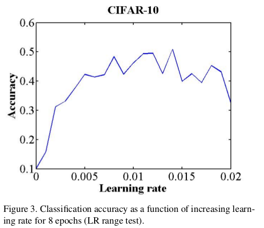
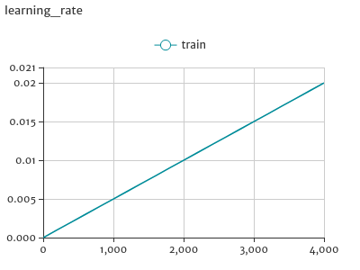
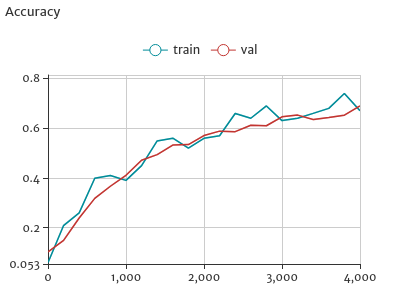
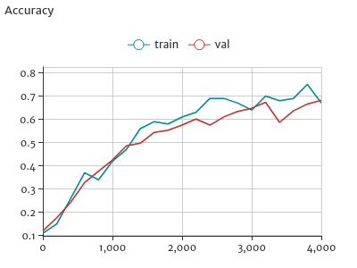
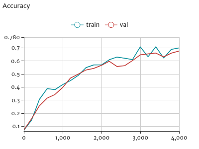
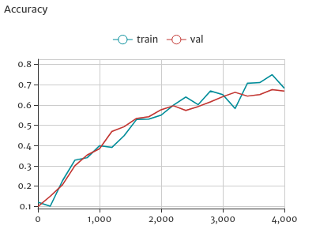
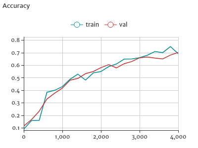
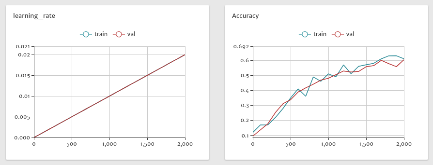
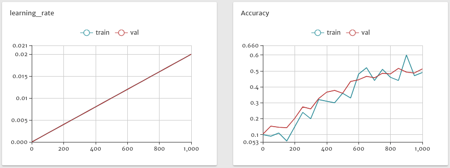
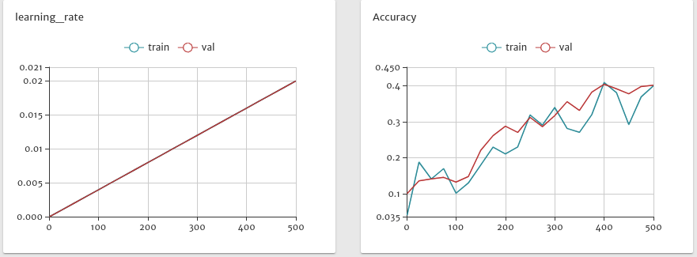

## Brief Intro

This repo aims to reproduce CLR's experiments on CIFAR-10 dataset, based on Caffe framework. 

The CLR algorithm is proposed in the paper "Cyclical Learning Rates for Training Neural Networks".

It turns out that by using the same settings as the paper said, the Accuracy does not drop or converge, thus the experiment result cannot be reproduced.

## 步骤1:Prerequesties
下载cifar-10数据，制作lmdb:
```bash
bash ./fetch_data.sh
bash ./create_cifar10.sh
```

准备solver和train/val的prototxt（从Caffe的CIFAR-10例子拷贝过来)

还需要安装visualdl，用于绘图、可视化。

## 步骤2:确定学习率上下界 (LR Range Test)

**实验设定**
论文原文是在CIFAR10上执行LR range test实验的，说用的Caffe自带的CIFAR-10的网络结构。其实Caffe自带了好几个，不过测试下来只有full版本、用softmax分类器的精度靠谱。

看一下论文原文的绘图:


从原文Figure 3看出，执行了8个epoch的训练，并且lr呈线性增加，也就是文章附录中的triangular策略的第一个cycle了，lr从`base_lr`增加到`max_lr`。因此，在`cifar10_full_solver.prototxt`中设定：
```
lr_policy: "triangular"
base_lr: 0
max_lr: 0.02   #这是看到Figure 3上的lr坐标范围而写的
```

然后注意到train和test阶段的`batch_size`都等于100，于是solver中继续设置：
```
test_iter: 100

# train_batch_num=50000/100=500,  500 * 8(epoch)=4000
stepsize: 4000 
max_iter: 4000
```

随后，开启训练：
```bash
cd $CLR
./experiments/scripts/lr_range_test.sh  #开启训练
visualDL --logdir experiments/vdl_logs --port 8080  #开启绘图，打开浏览器访问 http://localhost:8080 查看绘图结果
```

学习率呈线性增长：



因为不知道Figure 3绘制的Accuracy是train集上的还是val集上的，索性都绘制，实验做了5次希望避免偶然误差
。其中train的Accuracy是在单个batch(100张图)上测试，val的Accuracy是在整个测试集(10000张图)上测试：

第一次：



第二次：



第三次：



第四次：



第五次：



从上述5次独立重复实验结果来看，随着lr从0线性增加到0.02并且训练周期为8个epch的前提下，无论是train还是val其Accuracy一直呈增加趋势，论文原文Figure 3的Accuracy在后半段呈现大幅震荡并且有点下降趋势并不能重现出来。

尝试只做4个epoch:


尝试只做2个epoch:


尝试只做1个epoch:


至此，**论文原文Figure 3数据肯定有问题：实测的Accuracy持续增加而不存在"drop"和"start converging"的情况，则CLR算法后续确定的`max_lr=0.006`也无从说起，使用triangular2策略就明显有问题了**。

此外，最开始进行的重现试验中，本人将lr分别使用fixed策略和triangular2策略，想重现论文原文Tabel 1的前两行CIFAR-10的结果，发现数据根本对不上：进行了6次实验，fixed策略下的Accuracy始终只有78%~79%，达不到81.4%；并且fixed策略下，相同迭代次数上的Accuracy始终比triangular2策略下的要高，也就是说，**本人进行的实际实验结果表明，Tabel 1的前两行数据无法重现，triangular2策略比fixed策略要差而非更好**。
